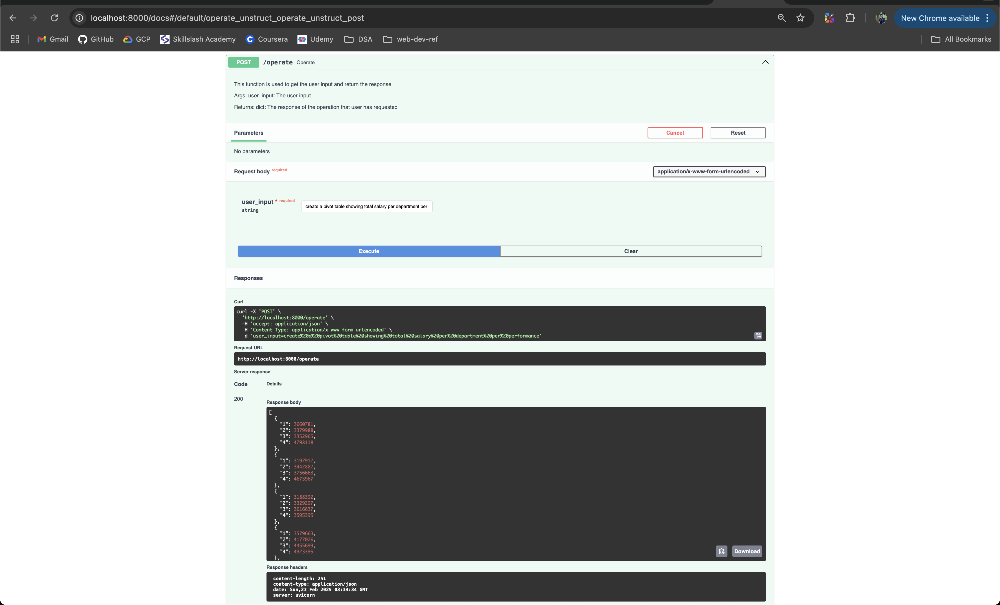
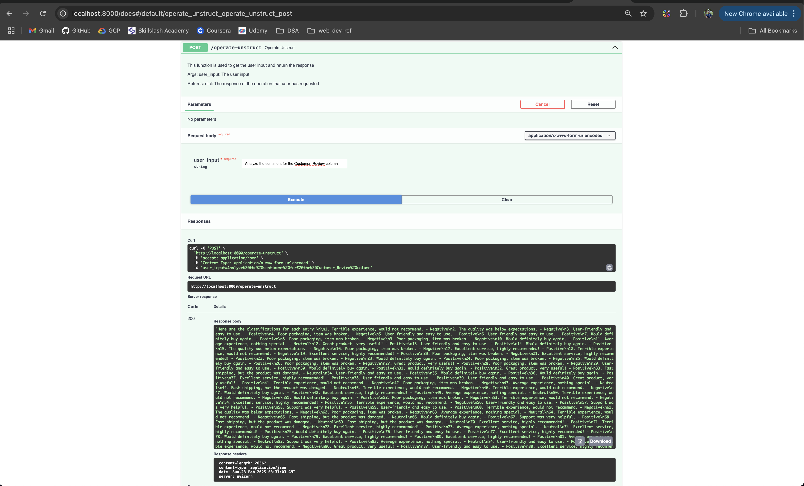

# Excel AI Engine

---

## Introduction

Excel AI engine is the comprehensive application engine that takes the user queries and implement it over the excel.

## How the engine Works?

The engine uses the Groq API to access the LLAMA model. We have a system prompt that provides the list of all the functions and the parameters that needs to be passed.

The input query goes like this along with the system prompt.

```python
create a pivot table showing total salary per department per performance Available Columns: Index(['ID', 'Age', 'Salary', 'Department', 'Experience_Years',
       'Performance_Rating', 'Education_Level', 'Location', 'Remote_Work',
       'Project_Count'],
      dtype='object')
```

And the LLM outputs the following function call

> **_NOTE:_**  As the LLM API is free API provided by Groq, it sometimes fails to create the output (8/10 times), Please re-run to see the output.

```python
pivot_table(df, 'Department', 'Performance_Rating', 'Salary', aggfunc='sum')
```

This function is then passed to the `eval` function in python to execute the function on the dataset to get the desired output.

## How to start the engine?

Clone The GitHub repository by this command:

```bash
git clone https://github.com/rishiagrawal2609/excel_ai_engine.git
```


The Docker file is provided to build the container, to build the container run the following command:

```bash
docker build -t excel-ai-engine .
```

Once it is built, you can start the container by the following command, please add your API key in place of `<YOUR_API_KEY>`.

```bash
docker run -p 8000:8000 -e GROQ_API_KEY=<YOUR_API_KEY> excel-ai-engine
```

The Engine will be up and running in `http://localhost:8000`


## API documentation

Swagger UI is avaialable as part of the the URL:

```python
http://localhost:8000/docs
```

The dataset is included as part of the repo with the name `Genrated_dataset.xlsx` to try the API out.

## Details about the end point

- `/` - To check if the FASTAPI Works or not

- `/upload` - To Upload the excel file. Mandatory step, the Genrated dataset is provided so that you can go ahead and download.

- `/upload-second` - To upload the second file for the join releated operations.

- `/query` - Check if the Query is recived by the backend. The processing do not work here.

- `/operate` - Provide the input Query here and the response will be the opeartion on the dataset.
Example user input: "Create a pivot table showing total salary per department per performance."



- `/operate-unstruct` - For the unstructured text data you can do the sentiment analysis.



## Know Issues

- Joins does not work as the input requires the addtional dataframe that is posing the problem with other functions.
